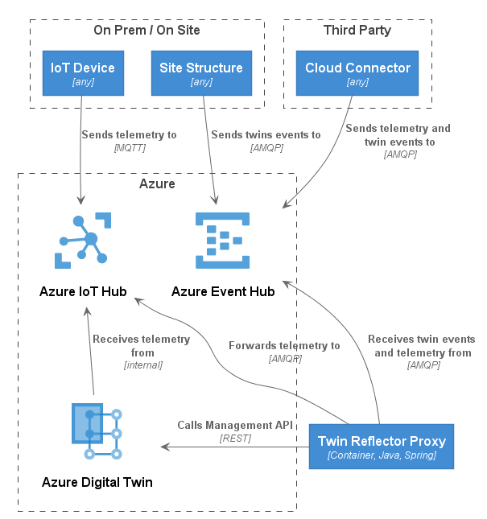

# Twin Reflector Proxy

This module aims to provide a dispatcher application that consumes Azure Event Hub event streams which contain topology changes and/or telemetry ingress. The goal is to provide cloud ingress point that serves as a bride between arbitrary IoT protocol gateways and Azure Digital Twins.

Disclaimer: the module is still work in progress and implementation pieces at this point have a PoC character at best.

## Overview

Twin instances (Create or update) are provided as event including properties, attributes and relationships. The events are processed from Azure Event Hub and mapped into several ADT RESTful management API calls.



## Deployment

see [deployment](deployment/azure) folder for further guidance on how to install the Twin Reflector Proxy on Microsoft Azure.

## Modules

- [twin-reflector-proxy-app](twin-reflector-proxy-app) - a Spring Boot App that packages the Twin Reflector Proxy in a cloud ready runtime (see [README.md](twin-reflector-proxy-app) for administration and configuration details).
- [twin-reflector-proxy-api](twin-reflector-proxy-api) - API definition for the [ingress](twin-reflector-proxy-api/src/main/java/com/microsoft/twins/reflector/model/IngressMessage.java) as well as [feedback](twin-reflector-proxy-api/src/main/java/com/microsoft/twins/reflector/model/FeedbackMessage.java) event streams including [error codes](twin-reflector-proxy-api/src/main/java/com/microsoft/twins/reflector/model/ErrorCode.java).
- [twin-reflector-proxy-core](twin-reflector-proxy-core) - Core implementation handling ingress message streams and applying to Azure Digital Twins as well as Azure IoT Hub.

## Ingress API specification

### Event Hub Headers

| Header                            | Values                                   | Required | Description                                                                                                                                                        |
| --------------------------------- | ---------------------------------------- | -------- | ------------------------------------------------------------------------------------------------------------------------------------------------------------------ |
| TwinReflectorProxy-MessageType    | `full`, `partial`, `delete`              | yes      |
| TwinReflectorProxy-EventTimestamp | e.g. `2018-09-20T07:35:00.8587882-07:00` | no       | timestamp as UTC as ISO 8601 formatted date string that identifies the sampling time of the payload. For example, 2018-09-20T07:35:00.8587882-07:00 (**optional**) |
| TwinReflectorProxy-CorrelationId  |                                          | no       | UUID (**optional**)                                                                                                                                                |

### Send event to create or update topology element

> The create and update message contains the full state (all attributes, all properties and all relationships) of the topology element!

#### Event Hub Message

**Headers:**

- TwinReflectorProxy-MessageType: `ingest`

**Message Payload (Example):**

```javascript
{
  "id": "F3",                               // external Id
  "entity-type": "Space",
  "attributes": {
     "friendlyName": "Office"
  },
  "properties": [
      {
          "entity-type": "propertykeys",
          "name": "title",
          "value": "Office London"
      }
  ],
  "relationships": [
      {
          "entity-type":     "space",
          "name":            "parent",
          "target-id":       "C1"           // external Id of the campus
      }
  ]
}
```

#### Twin Reflector Proxy Message Processing

- Query for the topology element by the external id (via ADT REST Management API as GET)
- Apply the attributes and properties from the message (Unit of Work Pattern)
- Creates or update the element in ADT (via ADT REST Management API as POST or PATCH)
- Updates the properties of the element in ADT

#### ADT State (ADT Model V1)

```yaml
# Space
- id: "7487abd8-a5b9-acab-5fdb-7a74ac1674f5"                  # ADT ID
 - name: "C1"

- id: "5d3600bc-5475-11e9-8647-d663bd873d93"                  # ADT ID
 - name: "F3"
 - friendlyName: "Office"
 - parentId: "7487abd8-a5b9-acab-5fdb-7a74ac1674f5"           # ADT Id parent
 - properties:
    title: "Office London"
```

### Send event to delete a topology element

#### Event Hub Message

**Headers:**

- TwinReflectorProxy-MessageType: `delete`

**Message Payload (Example):**

```javascript
{
  "id": "F3",                               // external Id
}
```

#### Twin Reflector Message Processing

- Query (search) for the topology element by the external Id.
- Delete the topology element.
- Do not delete other topology elements.

### Send telemetry data as event (sensor)

#### Telemetry - Event Hub Message

**Headers:**

- TwinReflectorProxy-MessageType: `ingest`
- Source: cbs

> Forward all non `Twin Reflector Proxy` event hub message headers to IoT Hub and prefix them (e.g. `TwinReflectorAgent-Source`).

**Message Payload (Example):**

```javascript
{
  "id": "S1",                               // external Id of the sensor (point)
  "entity-type": "Sensor",
  "attributes": {
     "dataType": "Temperature"
  },
  "properties": [
      {
          "entity-type": "propertykeys",
          "name": "displayName",
          "value": "Temperature XDK"
      }
  ],
  "relationships": [
      {
          "entity-type":     "device",
          "name":            "parent",
          "target-id":       "D1"           // external Id of the device (equipment)
      }
  ],
  "telemetry": "100"                        // any kind of telemetry data
}
```

#### Telemetry - Twin Reflector Message Processing

- Query for the sensor by the external Id
- Create or update the sensor via the management API
- Send the telemetry data to the IoT Hub
